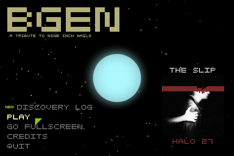
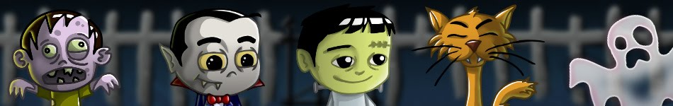
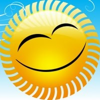
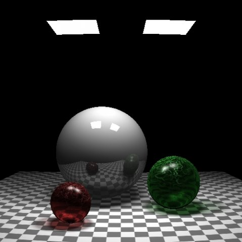
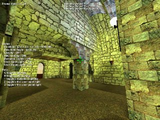

# [Francis Xavier Pulikotil](https://francisxavier.github.io/)

[LinkedIn](https://www.linkedin.com/in/francisxavierjp/) \| [Twitter](https://twitter.com/francisxavierjp) \| [Instagram](https://www.instagram.com/francisxavierjp)  

# Publications

[**Adapt Cast**](https://www.codeproject.com/Tips/1042460/Adapt-Cast) (Oct 29, 2015)  
Enable passing an argument by reference, to a function which expects an argument of a different type.  

[**ArrayView, StringView**](https://www.codeproject.com/Articles/848746/ArrayView-StringView) (Dec 02, 2014)  
Immutable, non-owning, efficient views over all or part of existing arrays and strings.  

[**Switching on custom objects**](https://www.codeproject.com/Tips/842266/Switch-custom-object) (Nov 14, 2014)  
A switch-like construct for custom objects to improve readability.  

[**A Type-safe Generic Pointer**](https://www.codeproject.com/Articles/159454/A-Type-safe-Generic-Pointer) (Aug 17, 2010)  
A safer alternative to void*, any_ptr can point to any type of object and provide type-safe, const-correct access to it.  

[**A Simple C++ Object Loader**](https://sourceforge.net/p/daabli/code/HEAD/tree/trunk/Docs/Guide%20I.pdf?format=raw) (Oct 06, 2009)  
A guide to deserializing objects using Daabli. Demonstrates how easy it is to load objects, enumerations, pointers and STL containers using Daabli. Also discusses Daabli's flexible string conversion mechanism.  

[**Super Factory**](https://www.codeproject.com/Articles/254722/Super-Factory) (Jul 17, 2009)  
A single unified interface for creating (almost) any kind of object in C++.  

[**Stringizing C++ Enums**](https://www.codeproject.com/Articles/42035/Enum-to-String-and-Vice-Versa-in-C) (Oct 25, 2008)  
A simple method to convert a C++ enumeration to its equivalent string representation and vice versa.  

[**Sealing Classes in C++**](https://www.codeproject.com/Articles/42021/Sealing-Classes-in-C) (Nov 19, 2007)  
A method to create sealed classes in C++.  

# Projects

## [B-Gen](http://bgengame.blogspot.com/)
A music-based game that uses music from Nine Inch Nails’ popular album - The Slip. _(C++, SDL, OpenGL, OpenAL)_

## [Frankie's Quest](http://frankiesquest.blogspot.com/)
A short puzzle game with story elements. _(C++, SDL, OpenGL, OpenAL, MinPSPW)_

## Daabli
[C++](http://daabli.sourceforge.net/) \| [C#](http://daabli.codeplex.com/)  
A simple cross-platform deserialization framework for C++ and C#.

## [RayWatch](http://sourceforge.net/projects/raywatch/)
A simple raytracer written by my brother, Angelo Rohit, for educational purposes. _(C++, SDL)_

## World Modeler Project
[Source](downloads/wmp_source.zip) \| [flipCode.org IOTD](http://www.flipcode.com/archives/09-25-2003.shtml)  
Something I did a long time ago, back when I was learning graphics programming. Some things of interest in the source: BSP tree generation from polygon soup; static light-map generation using ray-tracing. _(VC++ 6.0, Visual Basic 6.0, Direct3D 7.0)_

